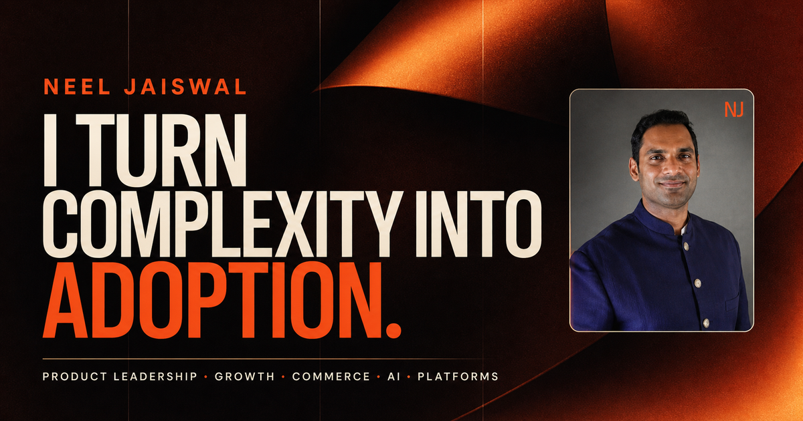

# Neel Jaiswal — product leadership portfolio

[](https://github.com/neeljaiswal90/neeljaiswal90.github.io/actions/workflows/ci.yml)

A recruiter-facing portfolio for a senior product leader working across AI, growth, commerce, enterprise platforms, retail, and regulated products.

- **Live site:** [neeljaiswal.com](https://neeljaiswal.com/)
- **Publishing runbook:** [docs/PUBLISHING.md](docs/PUBLISHING.md)
- **Architecture and implementation record:** [docs/IMPLEMENTATION_PLAN.md](docs/IMPLEMENTATION_PLAN.md)



## What ships

- A statically rendered Astro homepage with an anchored profile rail and eight narrative chapters.
- Six standalone case studies under `/work/[slug]/`.
- Motion-enhanced hero, AI system, experience, outcome, tool, and case-study scenes.
- Three palettes: Studio, Cinema, and Executive Navy.
- Keyboard, touch, direct-index, URL, no-JavaScript, and reduced-motion paths.
- Responsive AVIF/WebP renditions of owner-supplied real photographs.
- Self-hosted Manrope and Space Grotesk fonts; no production Google Fonts request.
- Canonical metadata, Open Graph/Twitter cards, JSON-LD, `robots.txt`, and sitemap generation.

## Architecture

Astro is the delivery layer because this is a content-led marketing site: every claim, route, link, and case-study narrative is readable in the initial HTML. Motion is a progressive enhancement, not a rendering dependency.

```text
src/data/*                     typed evidence, media, tools, projects, work
        ↓
Astro pages + layouts          semantic static HTML for seven routes
        ↓
components + scene CSS         responsive editorial presentation
        ↓
controller registry + Motion   optional interaction and choreography
        ↓
dist/                          portable production artifact
```

The main boundaries are:

- `src/data/` is the content and publishing authority. Claims, sources, media rights, tools, experience, projects, and work records live here.
- `src/components/` renders reusable page and case-study regions.
- `src/scripts/core/` owns controller lifecycle and reduced-motion state.
- `src/scripts/controllers/` owns reusable interactions such as navigation, filters, themes, dialogs, and the outcome explorer.
- `src/scripts/scenes/` owns section choreography; components do not create ad hoc global scroll listeners.
- `scripts/validate-content.mjs` fails the build if a production section references an unapproved claim or restricted media record.

## Case-study routes

- `/work/growth-system/`
- `/work/home-internet/`
- `/work/production-ai/`
- `/work/device-commerce/`
- `/work/enterprise-integration/`
- `/work/retail-self-service/`

Each case study follows the same recruiter-readable spine: problem, evidence, decisions, operating system, tradeoffs, measured result, and evidence boundary. Metrics are rendered from validated records instead of being duplicated in templates.

## Local development

Requirements are pinned in `.nvmrc` and `package.json`.

```powershell
npm ci
npm run dev
```

Open `http://localhost:4321/`.

Production checks:

```powershell
npm run check
npm run build
npm run test:e2e
npm run test:lhci
```

`npm run test:e2e` currently covers 36 browser checks across desktop, mobile, reduced-motion, no-JavaScript, accessibility, interactions, SEO, and case-study routes. Lighthouse audits the homepage and a representative case study against performance and payload budgets.

On some Windows/Chrome 150 installations, Lighthouse writes a valid report and then exits while deleting its temporary Chrome profile with `EPERM`. The Ubuntu GitHub Actions job is the release authority and does not use that Windows cleanup path.

## Continuous delivery

`.github/workflows/ci.yml` runs on pull requests and pushes to `main`:

1. Validate content, Astro, and TypeScript, then build once.
2. Run the complete Playwright browser matrix against that artifact.
3. Run the two-route Lighthouse budget gate.
4. On a successful `main` push only, deploy the exact verified artifact to GitHub Pages.

Action dependencies are pinned to full commit SHAs. The deployment job has only `contents: read`, `pages: write`, and `id-token: write` permissions.

## Content and publication boundaries

- Career history and outcome claims are centralized in `src/data/claims.ts` and linked to `src/data/sources.ts`.
- The J.D. Power ranking is company-level context. The restricted source chart does not ship in this repository or its public history.
- Owner-supplied competition photographs are presented as real event imagery, with responsive derivatives in `public/assets/`.
- Rejected generated medal concepts and obsolete static prototypes are excluded from the release tree.
- Tool marks are local SVGs used nominatively; their adjacent text supplies the accessible name. Source notes live in `public/assets/tools/README.md`.
- Product Toolkit acceleration figures are owner-supplied outcome claims. The open-weight model flow is clearly labeled as a reference architecture where it is not deployed proof.

## Regenerating local assets

Full-resolution source photos stay outside public Git history. Place owner-approved originals in the ignored `source-assets/` directory using the filenames listed in `scripts/optimize-media.mjs`, then run:

```powershell
node scripts/optimize-media.mjs
```

Font binaries can be refreshed from the recorded official endpoints with `scripts/fetch-fonts.ps1`; OFL notices live in `docs/licenses/fonts/`.

## Hosting variants

GitHub Pages is the primary production target. `npm run build:sites` additionally stages the static build as `dist/client/**` plus a minimal `dist/server/index.js` asset worker for OpenAI Sites packaging without changing the normal Astro output contract.
