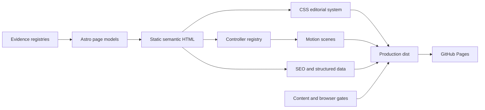

# Framer-quality portfolio architecture and implementation record

## Outcome

The portfolio now uses a static-first Astro architecture with a reusable content model and a shared Motion controller layer. It reproduces the qualities the reference sites make effective—editorial scale, persistent orientation, indexed exploration, cinematic media, and restrained ambient movement—without copying Framer template code or making animation a prerequisite for reading the work.

## Architecture review

The preserved prototype had strong art direction, but one HTML file, monolithic stylesheets, duplicated claims, and a global behavior script made new scenes increasingly risky. The production design separates four concerns:

1. **Evidence layer** — typed sources, claims, media rights, roles, outcomes, tools, and projects.
2. **Page layer** — Astro routes, layouts, and components that emit complete HTML before JavaScript.
3. **Motion layer** — controller lifecycle, shared reduced-motion state, and section-level scenes built with Motion.
4. **Quality layer** — content validation, Astro diagnostics, Playwright, Axe, Lighthouse budgets, CI, and gated deployment.

## Key decisions

### Static rendering is the contract

Recruiters and crawlers receive the whole narrative in the initial response. Astro produces one homepage and six case-study routes with no client framework runtime. JavaScript adds stateful movement, filtering, dialogs, theme persistence, and navigation only after the page is usable.

### Content is data, not template copy

Stable IDs connect production sections to approved claims and media. The build validator rejects unpublished or restricted references. Case-study view models reuse the same evidence rather than copying numbers into HTML.

### Motion has one lifecycle

Controllers are registered centrally and receive the same reduced-motion state. Scene files can animate only their owned region. This prevents duplicated observers, orphaned timelines, and content that remains hidden when JavaScript or animation fails.

### Rich interaction preserves equivalent paths

- The outcome explorer supports index controls, previous/next controls, keyboard navigation, touch scrolling, and direct anchors.
- Experience details remain native disclosures without JavaScript.
- Photo dialogs restore focus and close by button, Escape, or backdrop.
- Reduced motion produces immediate state changes and stops perpetual movement.
- Case studies remain complete and readable with JavaScript disabled.

### Media publication is explicit

Real photos have owner-supplied rights records and responsive AVIF/WebP variants. The J.D. Power chart is registered as restricted and cannot receive a production asset path. Rejected generated images are absent from the release tree.

## Delivered phases

| Phase | Delivered scope | Verification gate |
| --- | --- | --- |
| 0. Baseline | Preserved static prototype and recorded claims, media, themes, breakpoints, and Lighthouse baseline. | Local `static-v1` tag. |
| 1. Astro parity | Astro/TypeScript shell, components, semantic HTML, responsive styling, and production build. | Astro diagnostics and visual parity. |
| 2. Content system | Typed sources, claims, media, experience, tools, projects, work records, and build-time publication validator. | No duplicated metrics; restricted media fails validation. |
| 3. Motion foundation | Controller registry, Motion primitives, shared preference state, reveal/navigation/filter/dialog interactions. | No section-owned global lifecycle. |
| 4. Flagship scenes | Hero, compact AI pipeline, indexed outcomes, experience transitions, stack explorer, themes, and ambient movement. | Pointer, touch, keyboard, no-JS, and reduced-motion paths. |
| 5. Case studies | Six recruiter-readable `/work/[slug]/` narratives with shared layouts and evidence boundaries. | Each route stands alone and browser Back preserves context. |
| 6. Hardening | Responsive real-photo assets, self-hosted fonts, social card, metadata, JSON-LD, sitemap, robots, 36-test matrix, Lighthouse budgets, CI, and gated deployment. | Clean build, browser matrix, CI, and production URL. |

## Motion language

- **Reveal:** brief opacity/translate transitions for supporting content.
- **Mask:** clipped line or word entrances for major chapter statements.
- **Layout:** state transitions for filters, outcome navigation, and experience panels.
- **Progress:** page and case-study progress tied to actual scroll/navigation state.
- **Media:** restrained crop and scale changes; no synthetic event imagery.
- **Ambient:** low-contrast geometry and marquees that never obscure primary content.
- **Reduced motion:** instant settled states, no continuous marquees, no hidden starting state.

## Production budgets

- Performance score: at least 90
- Accessibility score: at least 99, plus no serious or critical Axe findings
- Best Practices and SEO: 100
- Median LCP: at most 3.0 s
- Median TBT: at most 200 ms
- Median CLS: at most 0.1
- JavaScript and CSS: at most 64 KiB each per audited route
- Fonts: at most 96 KiB
- Images: at most 768 KiB per audited route
- Total transfer: at most 1 MiB and 20 requests

Current direct Lighthouse observations are 99/100/100/100 on the homepage and 100/100/100/100 on the representative case study, with roughly 1.5–2.0 s LCP, 0–100 ms TBT, and negligible CLS. The release workflow reruns these checks on Ubuntu before deployment.

## Extension path

The current architecture does not need React or a CMS. Add either only when its operating need is real:

- Add Astro content collections or a headless CMS when non-developers must publish recurring writing.
- Add a small interactive island when a feature requires durable client state that the controller layer cannot express cleanly.
- Add analytics only with an explicit event schema, consent/privacy decision, and a zero-impact performance review.
- Add a custom domain by changing the single `canonicalOrigin` value after DNS and GitHub Pages ownership are configured.
